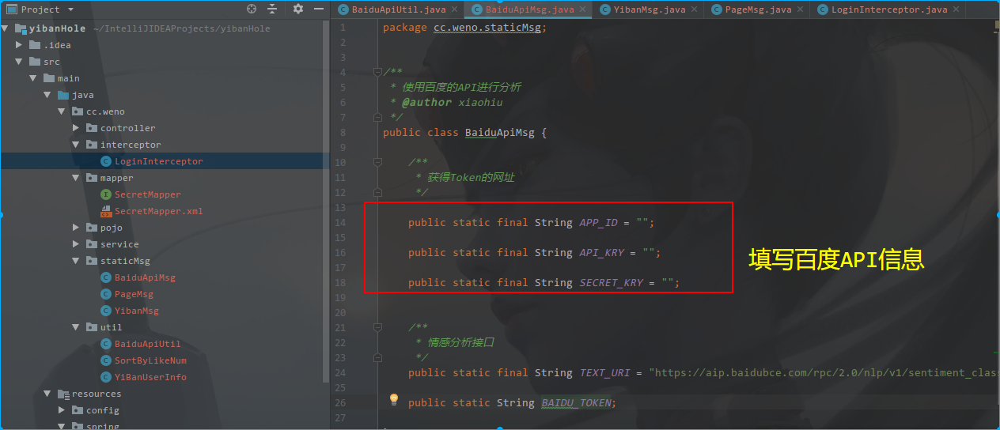
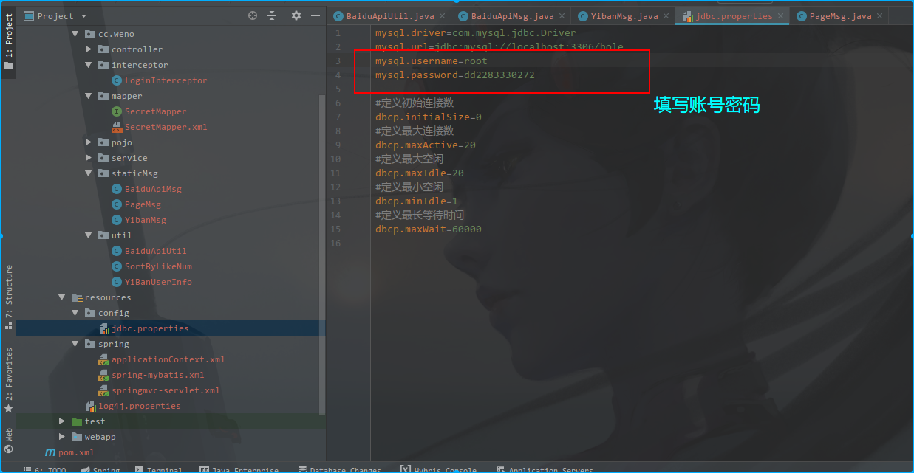

## 易班树洞网站

易班数据库的前端源码来自于贵州大学科技学院易班工作站，作者是：【点到直线】（如有侵权违规，请联系我删除）

网站后端为Java开发，框架是ssm框架【Spring、SpringMVC、Mybatis】。

树洞里面加入了百度的情感分析，API开发者信息填写。

易班的开发者信息填写

数据库的配置，数据库名字为：`hole`

数据库的配置文件,文件配置为

将【dump-hole-201812150251.sql】导入即可。

此项目的小坑总结[博客地址](https://www.cnblogs.com/xiaohuiduan/p/10125571.html)

SSM框架学习参考：[博客地址](https://www.cnblogs.com/xiaohuiduan/category/1349988.html)

